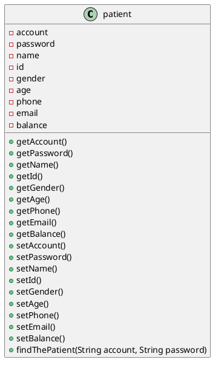
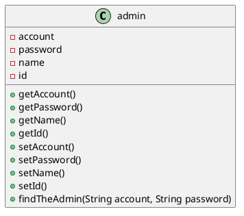
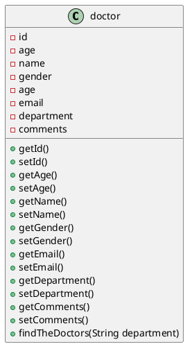
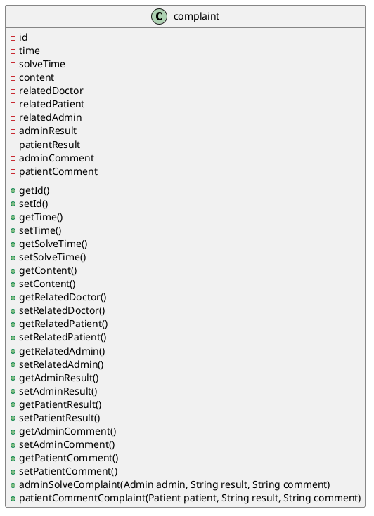
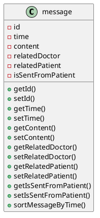

  投诉与问诊平台 

  第三小组 

假定与约束

示例

(1) E-R图

(2) 用例图

(3) 流程图

(4) 数据流图

(5) 类图

投诉模块

```puml
@startuml patient
class patient {
-account
-password
-name
-id
-gender
-age
-phone
-email
-balance
+getAccount()
+getPassword()
+getName()
+getId()
+getGender()
+getAge()
+getPhone()
+getEmail()
+getBalance()
+setAccount()
+setPassword()
+setName()
+setId()
+setGender()
+setAge()
+setPhone()
+setEmail()
+setBalance()
+findThePatient(String account, String password)
}
@enduml
```

```puml
@startuml admin
class admin {
-account
-password
-name
-id
+getAccount()
+getPassword()
+getName()
+getId()
+setAccount()
+setPassword()
+setName()
+setId()
+findTheAdmin(String account, String password)
}
@enduml
```

```puml
@startuml doctor
class doctor {
-id
-age
-name
-gender
-age
-email
-department
-comments
+getId()
+setId()
+getAge()
+setAge()
+getName()
+setName()
+getGender()
+setGender()
+getEmail()
+setEmail()
+getDepartment()
+setDepartment()
+getComments()
+setComments()
+findTheDoctors(String department)
}
@enduml
```

```puml
@startuml complaint
class complaint {
-id
-time
-solveTime
-content
-relatedDoctor
-relatedPatient
-relatedAdmin
-adminResult
-patientResult
-adminComment
-patientComment
+getId()
+setId()
+getTime()
+setTime()
+getSolveTime()
+setSolveTime()
+getContent()
+setContent()
+getRelatedDoctor()
+setRelatedDoctor()
+getRelatedPatient()
+setRelatedPatient()
+getRelatedAdmin()
+setRelatedAdmin()
+getAdminResult()
+setAdminResult()
+getPatientResult()
+setPatientResult()
+getAdminComment()
+setAdminComment()
+getPatientComment()
+setPatientComment()
+adminSolveComplaint(Admin admin, String result, String comment)
+patientCommentComplaint(Patient patient, String result, String comment)
}
@enduml
```

问诊模块

```puml
@startuml patient
class patient {
-account
-password
-name
-id
-gender
-age
-phone
-email
-balance
+getAccount()
+getPassword()
+getName()
+getId()
+getGender()
+getAge()
+getPhone()
+getEmail()
+getBalance()
+setAccount()
+setPassword()
+setName()
+setId()
+setGender()
+setAge()
+setPhone()
+setEmail()
+setBalance()
+findThePatient(String account, String password)
}
@enduml
```

```puml
@startuml doctor
class doctor {
-id
-age
-name
-gender
-age
-email
-department
-comments
+getId()
+setId()
+getAge()
+setAge()
+getName()
+setName()
+getGender()
+setGender()
+getEmail()
+setEmail()
+getDepartment()
+setDepartment()
+getComments()
+setComments()
+findTheDoctors(String department)
}
@enduml
```

```puml message
@startuml message
class message {
-id
-time
-content
-relatedDoctor
-relatedPatient
-isSentFromPatient
+getId()
+setId()
+getTime()
+setTime()
+getContent()
+setContent()
+getRelatedDoctor()
+setRelatedDoctor()
+getRelatedPatient()
+setRelatedPatient()
+getIsSentFromPatient()
+setIsSentFromPatient()
+sortMessageByTime()
}
@enduml
```

(6) 状态图

(7) 顺序图

(8) CRC 卡